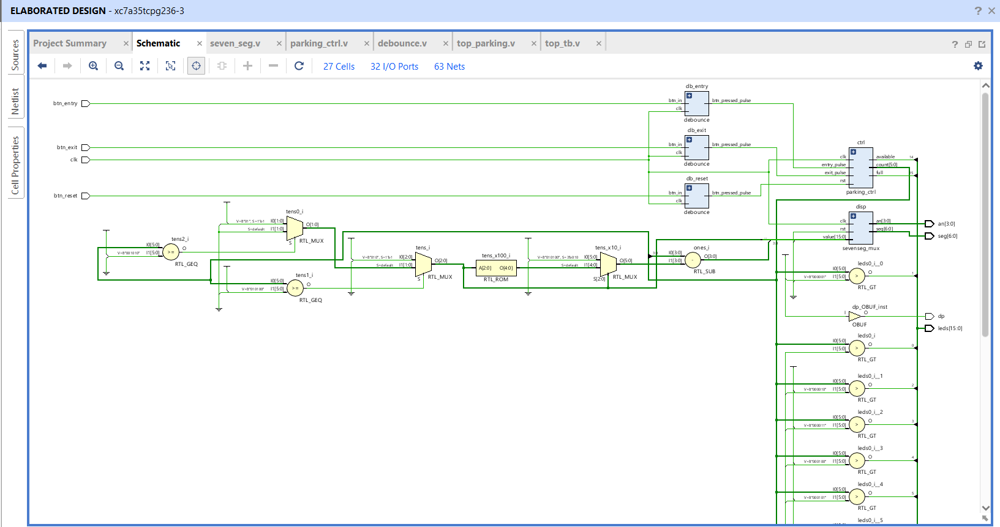
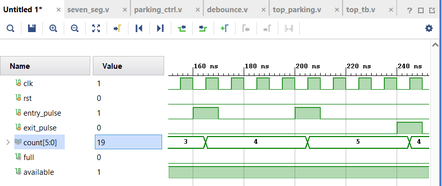
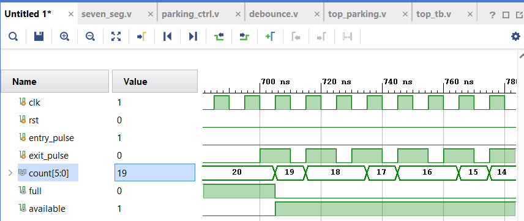
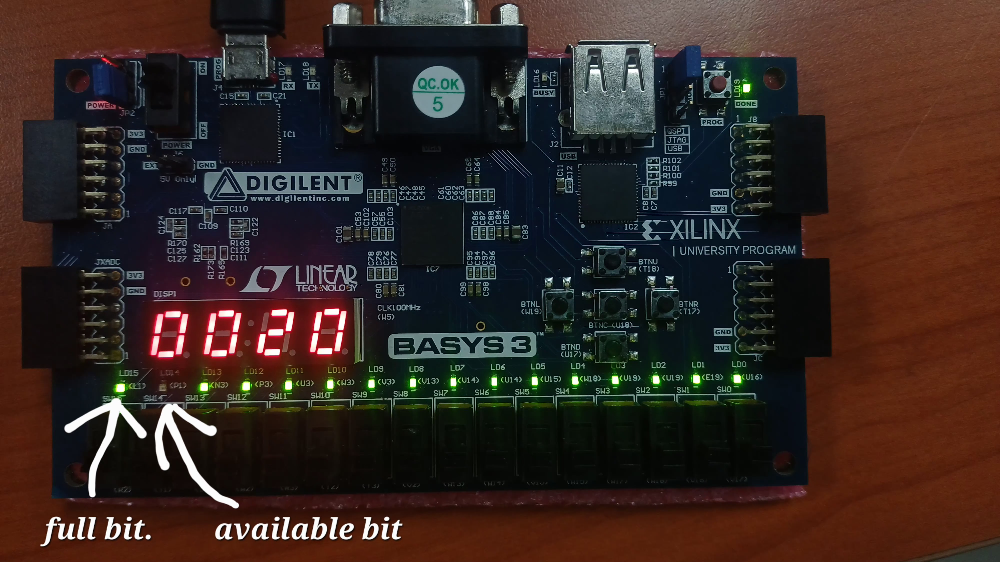

# FPGA Car Parking Controller

This project is a Verilog-based FSM controller for a car parking system, designed for a Xilinx FPGA (specifically the Digilent Basys3 board).

## Project Aim

The primary objective of this project is to design and implement a digital logic circuit that functions as a smart car parking controller. This system is designed for a parking facility with a fixed capacity of **20 spaces**.

The controller will use a Finite State Machine (FSM) and counters, written in Verilog, to accurately track the number of vehicles entering and exiting the lot. The system must provide real-time status updates to the user through various outputs on the FPGA board:

* **Live Count:** Display the current number of parked cars on the 7-segment display.
* **Availability Status:** Clearly indicate whether there are still parking spaces available (i.e., the count is less than 20).
* **Full Status:** Clearly indicate when the parking lot has reached its maximum capacity and no more cars can enter.

## Hardware & Software

* **Hardware:** Digilent Basys3 (Artix-7 XC7A35T)
* **Software:** Xilinx Vivado

## Features & Implementation

* **Car Counter:** The core `parking_ctrl.v` module maintains a count from 0 to 20.
* **Button Inputs:** The system uses three pushbuttons:
    * `btn_entry`: Increments the car count.
    * `btn_exit`: Decrements the car count.
    * `btn_reset`: Resets the count to 0.
* **Debouncing:** All pushbutton inputs are passed through a `debounce.v` module to prevent noise and false triggers, generating clean, single-cycle pulses.
* **7-Segment Display:** The current car count (0-20) is shown on the two rightmost digits of the 7-segment display. This is driven by the `sevenseg_mux.v` module.
* **LED Status Indicators:**
    * `leds[15]` (Full): Lights up when `count == 20`.
    * `leds[14]` (Available): Lights up when `count < 20`.
    * `leds[0-13]`: Act as a bar graph, where `leds[i]` is lit if `count > i`.

## Design Schematics

### Elaborated Design

### Synthesized Design

## Module Descriptions

This project is composed of several Verilog modules:

* `top_parking.v`: The top-level module that connects all components, including the buttons, LEDs, 7-segment display, and the core controller.
* `parking_ctrl.v`: The core Finite State Machine (FSM) / counter. It takes entry/exit pulses and manages the `count`, `full`, and `available` signals.
* `debounce.v`: A parameterized module that takes a noisy button input and generates a clean, single-clock-cycle pulse on a press.
* `sevenseg_mux.v`: A 4-digit, multiplexed 7-segment display driver that translates BCD (Binary Coded Decimal) values into segment patterns.
* `tb_parking_ctrl.v`: A testbench to simulate and verify the logic of the `parking_ctrl` module.
* `Basys3_Constraints.xdc`: The Xilinx Design Constraints file that maps the Verilog ports (clk, buttons, leds, etc.) to the physical pins on the Basys3 board.

## Results

### Simulation Waveforms
The `parking_ctrl` module was verified with the `tb_parking_ctrl.v` testbench.

**Waveform 1: Count Transitions**

**Waveform 2: Incrementing Count**

**Waveform 3: Full Signal Assertion**

### Hardware Implementation (Basys3 Board)

The design was successfully synthesized and implemented on the Basys3 board.

**Board Output 1: Initial State (Available)**

*Figure: Board showing 'Available' status (Count = 0000)*

**Board Output 2: Maximum Capacity (Full)**

*Figure: Board showing 'Full' status (Count = 0020)*